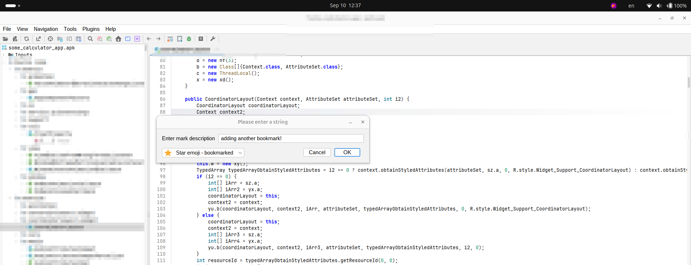
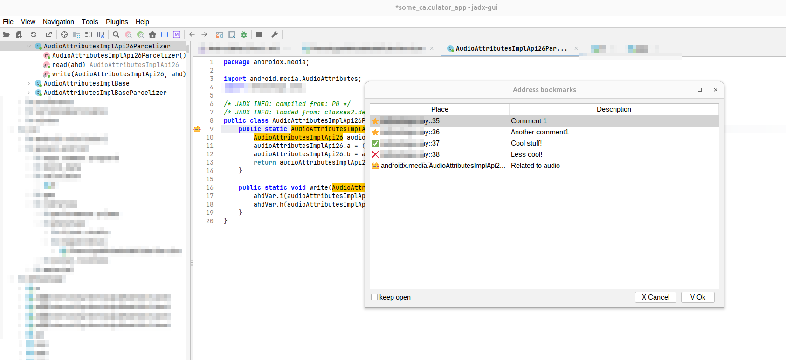

# JADX Bookmarks Plugin

A feature-rich bookmarks plugin for **[JADX](https://github.com/skylot/jadx)** with high-resolution full-color emoji markers, editor gutter line tracking icons, quick jump navigation, and persistent project storage.

---

## ✨ Features

- **Save & Modify Bookmarks (`Alt+M`)**:
  - Press **`Alt+M`** on any line (or right-click → **"Add/Edit Bookmark"**).
  - Clean dialog prompts: *"Please enter a string"* with input field *"Enter mark description"*.
  - Choose from 17 modern, full-color graphic emoji markers (defaults to ⭐ Star).
  - Editing an existing bookmark pre-fills current text and icon; pressing *"Cancel"* preserves it, while *"OK"* updates it.

  

- **Editor Gutter Line Markers**:
  - Displays the selected high-resolution color emoji icon directly on the line in the editor gutter.
  - Hovering over a gutter icon displays a tooltip in the format: `Place: Description`.
  - Double-click or right-click directly on any line number in the gutter to quickly add or modify a bookmark.
  - Automatically updates when decompilation finishes or when switching between Java and Smali tabs.

- **Address Bookmarks Dialog (`Ctrl+M`)**:
  - Open via **`Ctrl+M`** or **Plugins** / **Navigation** → **Address Bookmarks**.
  - Interactive table with:
    - **Place**: `class:function:line_number` accompanied by the full-color emoji marker.
    - **Description**: Bookmark note/comment.
  - **Double-click** or select + **`Enter`** to jump immediately to the line in decompiled code.
  - Right-click popup menu on table:
    - `Modify comment (Ins shortcut)`
    - `Delete (Del shortcut)`
    - `Copy (copy the line)`
    - `Jump to bookmark`
  - Table keyboard shortcuts: **`Ins`** (modify), **`Del`** (delete), **`Ctrl+C`** (copy line), **`Enter`** (jump), **`Esc`** (close).
  - **`[ ] keep open`** checkbox keeps the dialog open while jumping between bookmarks.

  

- **17 Full-Color High-Resolution Emoji Markers**:
  1. ⭐ Star emoji - bookmarked (default)
  2. ✅ Positive checkmark
  3. ❌ Red X mark
  4. 👍 Thumbs up
  5. 👎 thumbs down
  6. 👑 Crown
  7. 🚩 Red flag
  8. ⛳ green flag
  9. 1️⃣ 1 number emoji
  10. 2️⃣ 2 number emoji
  11. 3️⃣ 3 number emoji
  12. 💩 Pop emoji
  13. 🐳 Whale
  14. 🐵 Monkey
  15. 😊 Happy Face
  16. 😢 Cry Face
  17. 😍 Hearts in the eyes face

- **Persistence & Storage**:
  - Bookmarks are automatically saved as JSON in JADX's plugin data directory per project/file:
    ```
    ~/.config/jadx/plugins-data/jadx-bookmarks/bookmarks_<project_name>.json
    ```
  - Bookmarks auto-save instantly on every add, edit, or delete action.
  - Bookmarks reload automatically when opening or switching projects/APKs.

---

## 📦 Installation

### Option 1: Install from GitHub (Recommended)

Install directly using the JADX CLI:
```bash
jadx plugins --install "github:0rshemesh:jadx-bookmarks"
```

### Option 2: JADX GUI Plugin Manager
1. Download `jadx-bookmarks-1.0.0.jar` from the [Latest Release](https://github.com/0rShemesh/jadx-bookmarks/releases/latest).
2. Open **JADX-GUI**.
3. Go to **Plugins** → **Install plugin** (or **Preferences** → **Plugins** → **Install**).
4. Select the downloaded JAR file and click **Install**.

### Option 3: Manual Installation
Copy `jadx-bookmarks-1.0.0.jar` into your JADX installed plugins directory:
```bash
cp build/libs/jadx-bookmarks-1.0.0.jar ~/.config/jadx/plugins/installed/jadx-bookmarks.jar
```
*(Or into `~/.config/jadx/plugins/dropins/` or `<jadx_install_dir>/plugins/dropins/`)*.

---

## 🛠️ Building from Source

### Requirements:
- JDK 11 or higher (Compatible with JDK 11, 17, 21, and 24)

### Clone & Build:
```bash
git clone https://github.com/0rShemesh/jadx-bookmarks.git
cd jadx-bookmarks
./gradlew jar
```

The compiled plugin JAR will be generated at:
```
build/libs/jadx-bookmarks-1.0.0.jar
```

### Run Tests:
```bash
./gradlew test
```

---

## 👤 Author

Created and maintained by **0rshemesh**.

- GitHub: [@0rshemesh](https://github.com/0rShemesh)
- Repository: [jadx-bookmarks](https://github.com/0rShemesh/jadx-bookmarks)

---

## 📄 License

Apache License 2.0
